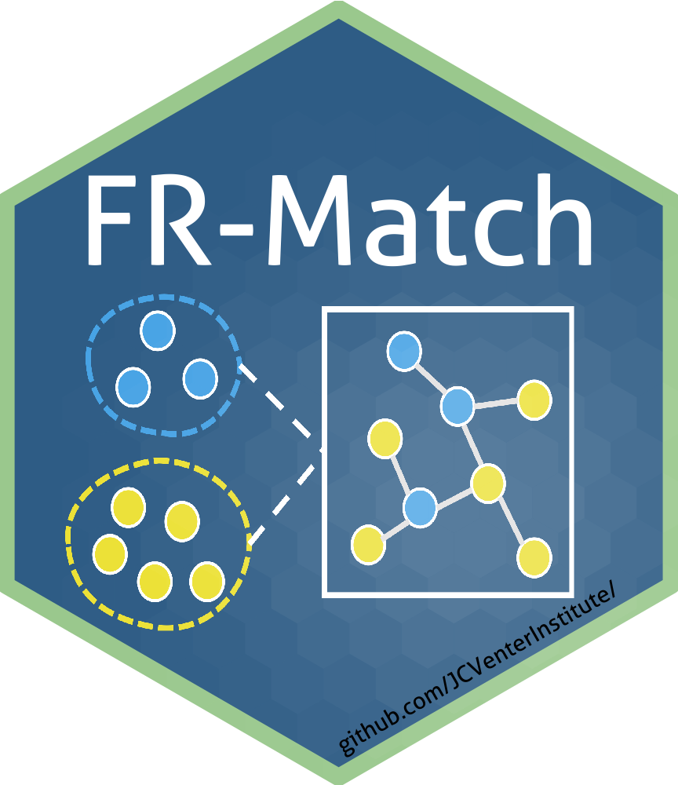

# Cell type matching in single-cell RNA-sequencing data using FR-Match



## Getting Started

## Prerequisites

* R, Shiny
* Data class: [Bioconductor-SingleCellExperiment](https://bioconductor.org/packages/release/bioc/html/SingleCellExperiment.html)
* Feature selection: [JCVenterInstitute/NSForest](https://github.com/JCVenterInstitute/NSForest) (suggested)

### Installation

```R
install.packages("devtools")
devtools::install_github("JCVenterInstitute/FRmatch")
```

### Tutorial

To start with a [tutorial](https://jcventerinstitute.github.io/celligrate/FRmatch-vignette.html).

### Shiny App

To start with a demo Shiny App:

```R
FRmatch::runShiny()
```

## Versioning

This repo is going through CI/CD (continuous integration and continuous delivery) code development. Stable releases are managed in [Releases](https://github.com/JCVenterInstitute/FRmatch/releases).

Please report issues using the [issue traker](https://github.com/JCVenterInstitute/FRmatch/issues).

## Citations

Zhang et al. 2022. Cell type matching in single-cell RNA-sequencing data using FR-Match. *Scientific Reports*, [https://doi.org/10.1038/s41598-022-14192-z](https://doi.org/10.1038/s41598-022-14192-z).

Zhang et al. 2020. FR-Match: robust matching of cell type clusters from single cell RNA sequencing data using the Friedman–Rafsky non-parametric test. *Briefings in Bioinformatics*, [https://doi.org/10.1093/bib/bbaa339](https://doi.org/10.1093/bib/bbaa339).

## Authors

* Yun (Renee) Zhang zhangy@jcvi.org
* Richard Scheuermann RScheuermann@jcvi.org

## License

This project is licensed under the [MIT License](LICENSE).

## Acknowledgments

* Allen Institute for Brain Science
* Chan Zuckerberg Initiative (DAF 2018–182730)
* The NIH BRAIN Initiative (1RF1MH123220)