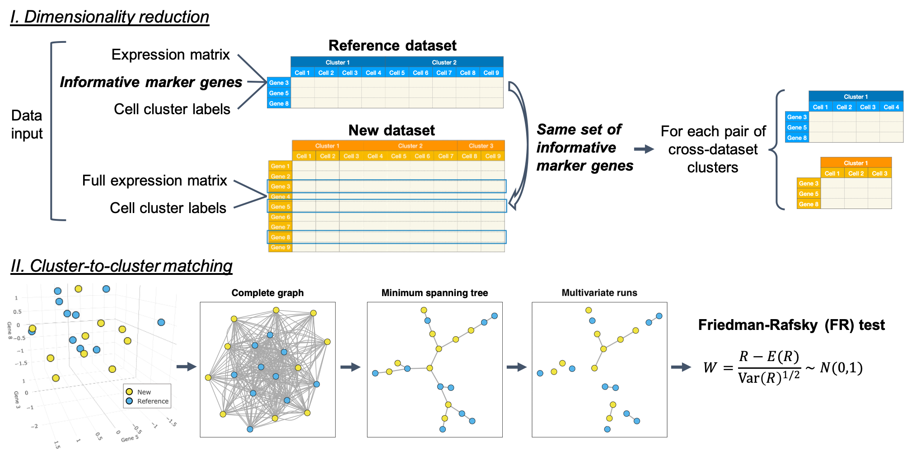

# Cell type matching in single-cell RNA-sequencing data using FR-Match


## Citation

Zhang et al. 2020. FR-Match: robust matching of cell type clusters from single cell RNA sequencing data using the Friedman–Rafsky non-parametric test. *Briefings in Bioinformatics*, [https://doi.org/10.1093/bib/bbaa339](https://doi.org/10.1093/bib/bbaa339).

## Description

Recently, the emergence of single cell RNA-sequencing (scRNA-seq) is providing large amounts of single cell transcriptomics data for the unbiased quantifications of cellular heterogeneity. Though scRNAseq data have been successfully generated by many labs, less attention has been paid to how knowledge derived from these data can be integrated across studies and leveraged by the whole single cell community.  In this R package, we provide a user-friendly scRNAseq integration tool that uses statistical methods to map new/query cell cluster data to the reference cell clusters.

Our method, FR-Match, is a novel application of the Friedman-Rafsky (FR) test, a non-parametric statistical test for multivariate data comparison in the context of single cell clustering results. We tailor the classical testing procedure for scRNAseq experiment data under the null hypothesis that there is no distributional difference in the two comparing clusters (i.e. a match) and the alternative hypothesis that the distributions of the two comparing clusters are different (i.e. a non-match) in the high-dimensional data space defined by selected gene features. Our procedure takes clustered gene expression matrices of query and reference experiments, and returns the FR statistic with adjusted p-value as evidence that the pair of comparing cell clusters is matched or not.



## Getting Started

Installation:

```R
install.packages("devtools")
devtools::install_github("JCVenterInstitute/FRmatch")
```

### Tutorial

To start with a tutorial [here](https://jcventerinstitute.github.io/celligrate/FRmatch-vignette.html).

### Shiny App

To start with a demo Shiny App:

```R
FRmatch::runShiny()
```

## Prerequisites

* R, Shiny
* Data class: [Bioconductor-SingleCellExperiment](https://bioconductor.org/packages/release/bioc/html/SingleCellExperiment.html)
* Feature selection: [JCVenterInstitute/NSForest](https://github.com/JCVenterInstitute/NSForest) (suggested)

## Versioning

The development of FR-Match follows a CI/CD (continuous integration and continuous delivery) coding practice. Stable releases and version control are managed in GitHub.

Please report issues using the [issue traker](https://github.com/JCVenterInstitute/FRmatch/issues).

## Authors

* Yun (Renee) Zhang zhangy@jcvi.org
* Richard Scheuermann RScheuermann@jcvi.org

## Acknowledgments

* Allen Institute for Brain Science
* Chan Zuckerberg Initiative (Completed grant: DAF 2018–182730)
* The NIH BRAIN Initiative (Active grant: 1RF1MH123220)

## License

This project is licensed under the [MIT License](LICENSE).
