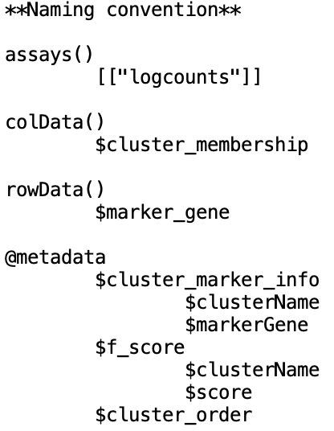

```{r setup, include = FALSE}
knitr::opts_chunk$set(
  catch = TRUE,
  collapse = TRUE,
  comment = "#>"
)
```

# Overview

## Workflow

General steps of FR-Match include:

- **Feature selection/dimensionality reduction** using the *supervised* [NS-Forest](https://github.com/JCVenterInstitute/NSForest) marker gene selection algorithm or other *informative* marker gene set per user's choice. Our choice of the NS-Forest marker gene selection provides a minimum set of marker genes that maximize the classification power of differentiating clusters in the reference dataset. 
-	Construct **minimum spanning trees** for each pair of query and reference clusters.
-	Calculate **FR statistics and p-values** based on the minimum spanning tree plots.

{width=100%}

## Installation

To install from GitHub repository,
```{r, install, eval=FALSE}
install.packages("devtools")
devtools::install_github("JCVenterInstitute/FRmatch")
```

After successful installation, load FR-Match and other useful packages to your R environment.
```{r, package, message=FALSE}
library(FRmatch)
library(SingleCellExperiment)
library(dplyr)
library(tibble)
library(data.table)
```

## Shiny App

We complement this package with a Shiny App, which can be launched by calling the following function.
```{r, shinyapp, eval=FALSE}
runShiny()
```


# Getting data ready 

## Input data

FR-Match is a cell type matching method for two independently conducted scRNAseq experiments, namely, query and reference. For each experiment, FR-Match takes in the following input data:

- Reference dataset
    + A cell-by-gene expression matrix
    + Cell type cluster membership
    + *Informative* marker genes for the reference cell types
- Query dataset
    + A cell-by-gene expression matrix
    + Cell type cluster membership

There are many pieces of data information needed for various scRNAseq data analyses. We choose to use the `SingleCellExperiment` class to organize the input data, which is a convenient container for scRNAseq data. For instructions on how to construct a `SingleCellExperiment` object, please see [An introduction to the SingleCellExperiment class](https://www.bioconductor.org/packages/devel/bioc/vignettes/SingleCellExperiment/inst/doc/intro.html).

For an FR-Match data object, the following data are essential:

- a gene expression data matrix (`assay()`)
- cell type cluster labels (`colData()`)
- NS-Forest or your own marker genes for the reference dataset (`rowData()`)

In addition, metadata (`@metadata`) such as F-beta score and cluster order are not essential for the core matching algorithm, but these information will facilitate visualization and other customized analysis tools provided in this package.

## An example data object

In this package, we include an example data object `sce.example`. For more details, please see `help("sce.example")`. A quick look at the data object below.
```{r, data-example, warning=FALSE, message=FALSE}
data(sce.example)
sce.example
```

The naming convention and data structure are listed below.

{width=30%}

## Layer 1 and full MTG data

Here, we introduce two datasets to be used in this vignette. Both datasets are generated by the Allen Institute for Brain Science using Smart-seq2 protocol for single nucleus RNA sequencing. The first is the pre-containerized dataset in the data object `sce.example`, which is sampled from a single layer (layer 1) of cerebral cortex from the middle temporal gyrus (MTG) region of human brain ([Boldog et al., 2018](https://www.nature.com/articles/s41593-018-0205-2)). In the layer 1 dataset, there are 16487 genes and 865 cells; 15 cell type clusters are identified and labeled by the authors.

```{r, data-layer1}
## rename the data object
sce.layer1 <- sce.example
## cell type clusters and cluster sizes
knitr::kable(table(colData(sce.layer1)$cluster_membership), col.names=c("Cluster", "Size"), row.names=1:15)
```

The second dataset is sampled from the full laminar depth (layer 1-6) of the MTG cerebral cortex ([Hodge et al., 2019](https://www.nature.com/articles/s41586-019-1506-7)). The MTG dataset consist of 13945 genes and 15603 cells; 75 cell type clusters are identified and labeled by the authors. We are going to devote the next section to introduce a function that compiles the necessary input data files from the MTG dataset into a data object that can be used in our matching function.

**The biological ground truth** is that these two datasets are from neuroanatomical overlapping regions, therefore, we would expect each layer 1 cell type to be matched with one full MTG cell type. Good matches should reflect the laminar characteristics of these cell types, i.e. matches should be found in the upper layer cell types of the full MTG dataset.

## Construct data object using `make_data_object()`

(We suggest downloading the data files by copying and pasting the following URLs into your browser, and reading the files from your local folder.)

```{r, data-read-aws}
## read in pieces of input data - this may take a few minutes
cell_by_gene_expression <- fread("https://allen-data.s3-us-west-2.amazonaws.com/cell_by_gene_expression.csv")
cell_cluster_labels <- fread("https://allen-data.s3-us-west-2.amazonaws.com/cell_cluster_labels.csv")
NSForest_marker_genes <- fread("https://allen-data.s3-us-west-2.amazonaws.com/NSForest_marker_genes.csv")
NSForest_fscores <- fread("https://allen-data.s3-us-west-2.amazonaws.com/NSForest_fscores.csv")
MTG_taxonomy <- fread("https://allen-data.s3-us-west-2.amazonaws.com/MTG_taxonomy.csv")$x #need to be a vector

## unique markers
unique_markers <- unique(NSForest_marker_genes$markerGene)
```

Use the `make_data_object()` function to compile the pieces of input data into a data object.
```{r, make-data-object}
sce.MTG <- make_data_object(dat = cell_by_gene_expression,
                            tab = cell_cluster_labels,
                            markers = unique_markers,
                            ## below are optional input data
                            cluster_marker_info = NSForest_marker_genes,
                            f_score = NSForest_fscores,
                            cluster_order = MTG_taxonomy)
```

Take a look at the data object for the full MTG.
```{r, data-MTG}
sce.MTG
```

*It may cause some confusion on the cell-by-gene or gene-by-cell orientation of the expression data. To be clear, the raw input data (.csv or .txt file) for gene expression should have cells in rows and genes in columns (cell-by-gene). After the input data is read into the data object (e.g. sce.example), the expression data is stored as genes in rows and cells in columns (gene-by-cell). We made such arrangement because conventionally R packages, such as Seurat, deal with gene-by-cell expression data; and Python packages, such as Scanpy, deal with cell-by-gene expression data.*

# FR-Match

## Cell type "barcode"

In the FR-Match workflow, we utilize the informative marker genes for dimensionality reduction. Good marker genes display on-off binary expression pattern producing, in combination, a unique gene expression “barcode” for each cell type cluster. We provide the `plot_cluster_by_markers()` function for plotting the marker gene expression patterns for a random set of cells in each cluster, visualizing the cell type "barcode". Examples below show that the "barcodes" for excitatory cell type, glial cell type, and inhibitory cell type from the layer 1 data are distinctively different using the NS-Forest marker genes.

```{r, barcode-plot, fig.height = 5, fig.width = 7}
plot_cluster_by_markers(sce.example, cluster.name = "e1_e299_SLC17A7_L5b_Cdh13", name.E1 = "Layer1_")
plot_cluster_by_markers(sce.example, cluster.name = "g1_g48_GLI3_Astro_Gja1", name.E1 = "Layer1_")
plot_cluster_by_markers(sce.example, cluster.name = "i1_i90_COL5A2_Ndnf_Car4", name.E1 = "Layer1_")
```

## Cluster sizes

Take a look at the cluster sizes in these two datasets.
```{r, plot-clusterSize, fig.height = 9, fig.width = 9}
plot_clusterSize(sce.layer1, sce.MTG, name.E1 = "Layer1", name.E2 = "MTG")
```

Note that cluster sizes range widely, which may cause the unbalance cluster size issue in the FR test.

## Run `FRmatch()`

The `FRmatch()` function is a wrapper function that takes in two input data objects in the `sce.query =` and `sce.ref =` arguments. By performing this function, it carries out our matching workflow in default setting. Key steps are reported while running. To start, let's regard `sce.layer1` as the query data and `sce.MTG` as the reference data.

```{r, FRmatch_layer1toMTG, warning=FALSE, message=FALSE}
rst.layer1toMTG <- FRmatch(sce.query = sce.layer1, sce.ref = sce.MTG)
```

**A few remarks:**

- Note that not all clusters are passed to the matching algorithm. In the default setting, query and reference clusters with less 10 cells are filtered out. This is can be tuned using the `filter.size =` argument. It is also optional to filter clusters based on F-beta score using the `filter.fscore=` argument.
- `FRmatch()` uses an iterative subsampling scheme to overcome the unbalanced cluster sizes between the query and reference clusters when applying the FR test. The default settings are `method="subsampling", subsamp.size=10, subsamp.iter=1001, subsamp.seed=1`.
- Due to the iterative scheme, it may take some computational time. We provide the `numCores=` argument to specific the number of cores to utilize for parallel computing.

Also, we may want to swap the query and reference data to perform FR-Match in the other direction. In practice, if we want to match between two independently conducted experiments (for example, each experiment may focus on a different specimen region, inducing different cell type clusters and different set of marker genes), different directions of matching may lead to quiet different matching results. We recommend to perform both directions of matching, and conclude with a consensus matching results from both directions. 

```{r, FRmatch_MTGtolayer1, warning=FALSE, message=FALSE}
rst.MTGtolayer1 <- FRmatch(sce.query = sce.MTG, sce.ref = sce.layer1)
```

The `FRmatch()` output is a list of results. The best way to present these results is to use our customized plotting functions.

## Plot bi-directional matching results

The final matching results from both directions can be combined using the `plot_bi_FRmatch()` function. The function takes in the `FRmatch()` outputs from both directions, and displays the two-way match (match found in both directions), one-way match (match found in either direction), and no match in the following plot.

```{r, FRmatch-bi-plot, fig.height = 13.5, fig.width = 7}
plot_bi_FRmatch(rst.layer1toMTG, rst.MTGtolayer1, name.E1="Layer1_", name.E2="MTG_")
```

**FR-Match uniquely maps cell types reflecting the overlapping anatomic regions.** Using FR-Match, we mapped most of the layer 1 cell types uniquely to one MTG cell type, i.e. 1-to-1 two-way matches. These matches precisely reflect the overlapping anatomic regions in these two independent experiments in that the matched MTG cell types all have an ‘L1’ layer indicator in their nomenclature. The couple exceptions of 1-to-many two-way matches may suggest under-partitioning of the layer 1 cell type; but the multiple matches are next to each other given the order of the MTG cell types follow the hierarchical taxonomy in Figure 1c of [Hodge et al. (2019)](https://www.nature.com/articles/s41586-019-1506-7).

## Plot one-directional matching results

We also provide the function `plot_FRmatch()` that takes in single `FRmatch()` output with argument `type = "matches"` by default, and optionally `type = "padj"`, to visualize the matching results from one direction.

```{r, FRmatch-plot-matches, fig.height = 13.5, fig.width = 7}
## to visualize the one-directional matches
plot_FRmatch(rst.layer1toMTG)
```
```{r, FRmatch-plot-padj, fig.height = 4, fig.width = 7}
## to visualize the adjusted p-values for each query cluster
plot_FRmatch(rst.layer1toMTG, type = "padj")
```

**A few remarks:**

- For the plots above, note that the prefixes of these cluster names are "query." and "ref.", which are coded in our program as default option. We deliberately leave it that way since: 1) it helps our users to distinguish the direction of the one-directional matching; and 2) we sort of regard the one-directional matching as an internal step and strongly recommend to perform the matching in both directions. These prefixes can be changed by specifying the `prefix=` argument in the `FRmatch()` function.
- Users may also obtain the actual values from above plots by specifying the `return.value = TRUE` argument in the corresponding plotting function.

Look at the matching results in the other direction
```{r, FRmatch-plot-matches-2, fig.height = 5, fig.width = 13.5}
## to visualize the one-directional matches
plot_FRmatch(rst.MTGtolayer1)
```
```{r, FRmatch-plot-padj-2, fig.height = 4, fig.width = 8}
## to visualize the adjusted p-values for each query cluster
plot_FRmatch(rst.MTGtolayer1, type = "padj")
```

It is interesting to see that the matching performance depends on the granularity and/or quality of the reference dataset. It is expected that the reference dataset is more comprehensive, such as the MTG data in this example, so that the one directional matching results in this direction align more with the bi-directional matching results. 

<!-- ## Non-zero expression plot -->

<!-- We also provide a supporting function that calculates and plots the "% expressed per marker gene per cluster" for the \code{FRmatch} input data object. The percentage is defined as -->

<!-- > number of cells that express the marker gene in the cluster / cluster size -->

<!-- The NS-Forest algorithm is designed to select the minimum set of *binary* genes for each cluster, which has the "best" classification score (measured by F-measure) differentiating the cluster from all other clusters pooling together. The *binaryness* is desirable because it is pragmatically important for many downstream use cases of marker genes. Therefore, we are looking for few dropouts of the marker genes in the cluster that they mark, which can be checked using -->

<!-- ```{r, dropout, fig.height=8, fig.width=7} -->
<!-- plot_nonzero(sce.example, return.value=FALSE, return.plot=TRUE) -->
<!-- ``` -->

# Other useful functions

## Friedman-Rafsky test 

We also implemented our own function `FRtest()` for [Friedman-Rafsky (FR) test](https://projecteuclid.org/download/pdf_1/euclid.aos/1176344722) with customized options. FR test is a multivariate generalization of non-parametric two-sample test. It is a graphical model based on the concept of [minimum spanning tree](https://en.wikipedia.org/wiki/Minimum_spanning_tree) (MST). The MST provides a way to visualize high-dimensional clustered data in a low-dimensional visualization. A minimal working example of FR test and MST visualization is below.

```{r, FR-test, fig.height = 7, fig.width = 7}
# simulate some synthetic data from the same distribution
samp1 <- matrix(rnorm(1000), nrow = 50) #a 50-by-20 matrix: 50 dimensional, 20 data points
samp2 <- matrix(rnorm(1000), nrow = 50) #a 50-by-20 matrix: 50 dimensional, 20 data points
# FR test with MST plot
FRtest(samp1, samp2, plot.MST = TRUE, main = "Minimum spanning tree")
```

In the above test, the p-value suggests that no difference between the two simulated samples. 

We encourage our users to visually examine their interested cell type clusters on MST plots.

# Session info
```{r, sessionInfo}
sessionInfo()
```
